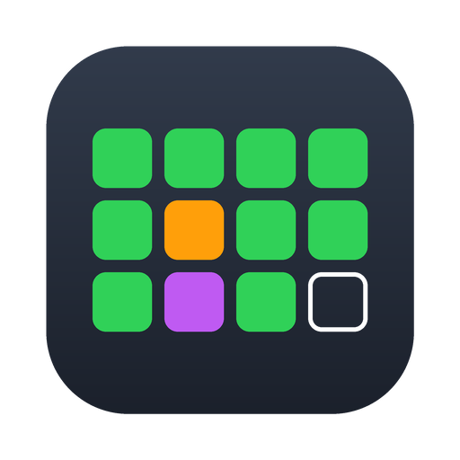

<p align="center">
  
</p>

<h1 align="center">Costpoint Timesheet</h1>

<p align="center">
  <strong>Your Deltek Costpoint timesheet, filed for you — and one dot in the menu bar that tells you it's done.</strong>
</p>

<p align="center">
  <picture>
    <source media="(prefers-color-scheme: dark)" srcset="docs/day-strip.png">
    
  </picture>
</p>

<p align="center">
  <a href="https://github.com/mrpeanut01/costpoint-time/releases/latest"><strong>Download the .dmg →</strong></a>
</p>

<p align="center">
  <em>macOS 11+ · universal · no Python to install</em>
</p>

---

Timesheets are a five-second task you have to remember 250 times a year, and the
cost of forgetting is never five seconds. This fills yours on a schedule, backfills
the days you missed, signs the period when the hours reconcile, and otherwise stays
out of the way as a single coloured dot.

It talks to the **same JSON API the official Costpoint mobile app uses** — three
POSTs to sign in, a batch of result-set calls to read and save. No headless
browser, no DOM scraping, no screenshots. The client is `urllib`, plus certifi
for the root certificates.

## What it does

- **Files your time every weekday**, at an hour you pick, on the charge you'd have picked.
- **🟢 or 🔴 at a glance.** Green means the period is complete. Red means a weekday is missing time.
- **Click a day to change it.** Each cell cycles work → 🎉 holiday → 🌴 PTO. No dialogs, no forms.
- **Self-heals.** Laptop asleep, VPN down, long weekend — the next run backfills every weekday it missed.
- **Signs the period** on the last working day, but only after auditing that weekdays × hours equals what's actually entered. If it doesn't reconcile, it refuses and tells you why.
- **Knows the US federal holidays** and pre-fills them, so you're not confirming Thanksgiving every year.
- **Never pre-files.** A future day records your intent only; the right charge goes in during normal time entry on the day.
- **Finds your charge codes for you.** Costpoint flags which of your favourites is the holiday charge and which is PTO, so setup is usually zero questions.

## Install

macOS 11 Big Sur or later, Apple Silicon or Intel. Python 3.13 is inside the app —
you don't need one, and the app doesn't touch the one you have.

1. Download the latest **[.dmg](https://github.com/mrpeanut01/costpoint-time/releases/latest)**
   and open it.
2. Drag **Costpoint Timesheet** into Applications.
3. Tell macOS you meant it:

   ```bash
   xattr -dr com.apple.quarantine "/Applications/Costpoint Timesheet.app"
   ```

4. Open it from Applications. The ⚪️ dot in the menu bar is where setup starts.

Step 3 is there because these builds aren't signed with an Apple Developer ID
(that needs a paid membership). macOS flags anything downloaded as untrusted and
won't open it until told otherwise; the command clears that flag. If you'd rather
not use Terminal: open the app, dismiss the warning, then go to System Settings →
Privacy & Security and click **Open Anyway**.

Nothing else about the app is different — it's the same build either way, and
[`docs/RELEASING.md`](docs/RELEASING.md) covers turning signing on if a
membership ever appears.

**There is no installer**, because opening the app *is* the install: it writes its
own two launch agents — the daily run, and itself at login — pointing at wherever
you put it. Move the app later, or replace it with a newer one, and the next
launch repairs them.

> **Open it from Applications, not from the disk image**, and don't skip step 3.
> While that quarantine flag is set, macOS runs the app from a temporary
> read-only copy of its own at a path that won't exist next time — so there'd be
> nothing left for the daily job to point at. The app checks for this, and says
> so, rather than scheduling a run that would silently never happen.

### Upgrading

Drag the new app over the old one, clear the quarantine flag again (step 3 —
it comes back with every download), and open it. Your credentials, plan and
charge codes live in `~/Library/Application Support/costpoint-timesheet/` and
aren't touched.

Coming from a `./deploy.sh` install, it's the same: the app takes over both
launch agents the first time you open it. The old `.venv` in that directory is
dead weight afterwards and can go.

## First run

Click the ⚪️ dot → **Credentials**, and fill in four things:

| | |
|---|---|
| **Server** | `yourcompany-cp.costpointfoundations.com` |
| **Organization** | your Costpoint org code, e.g. `ACMECORPLLC` |
| **Username** | e.g. `12345.J.DOE` |
| **Password** | stored in a `0600` file, never leaves your Mac |

Saving tests the sign-in and then reads your **charge favourites** straight out of
Costpoint. Holiday and PTO identify themselves; if you have exactly one working
charge it's picked too, and you're done. If you have several, choose one under
**Charges**.

## The menu

Everything lives in one menu. There's no window, no preferences pane, no browser tab.

```
Today · Mon Mar 2 — 8h Project Work
Mar 1  – ▪▪▪▪▪ – – □ H P P □ – – □   Mar 16   ›
Period 005  ·  40/88h
────────────────────────────────────────────────
⏰  Next run · tomorrow at 9:00 AM              ▸
────────────────────────────────────────────────
🔑  Credentials                                 ▸
🏷  Charges                                     ▸
📄  Open log
Quit
```

**The day strip** is one cell per day of the period:

| Cell | Meaning |
|------|---------|
| 🟩 green | hours entered |
| 🟥 red | a weekday that should have time and doesn't |
| 🟧 **H** | holiday |
| 🟪 **P** | PTO |
| ▫️ outlined | an empty working day |
| — thin rule | weekend |

Solid means Costpoint has it; outlined means it's planned and on its way. Today is
ringed, `🔒` marks a signed period, and hovering a cell shows the date and what's
on it. The `›` and `‹` carets walk through periods, so you can plan leave months
ahead.

**Next run** shows when the job fires next, and holds *run it now*, *sync now*, and
the schedule — pick any hour, and it rewrites the launch agent and reloads it.

## How it decides what to charge

In order:

1. **Your plan** — a day you marked PTO or holiday in the strip.
2. **The federal calendar** — pre-filled, and overridable per day (some companies work Columbus Day; some add Christmas Eve).
3. **Your working charge** — everything else.

A day that already has hours is left alone, so anything you entered by hand in
Costpoint survives. Changing such a day is deliberate: click it, and the automation
replaces the hours in a single save — with the revision explanation Costpoint
requires, which it generates for you.

## What it stores, and where

```
~/Library/Application Support/costpoint-timesheet/
├── .env           credentials, mode 0600
├── config.json    server, charge codes, your charge favourites
├── plan.json      which days are PTO, which holidays you observe
└── status.json    cached day colours, so the strip works offline
```

Nothing is sent anywhere except your own Costpoint server. `plan.json` is the whole
contract between the menu bar app and the scheduled run — quit the app and the
automation carries on without it.

## Uninstall

```bash
launchctl bootout gui/$(id -u)/com.costpoint-timesheet.tray
launchctl bootout gui/$(id -u)/com.costpoint-timesheet.daily
rm -f ~/Library/LaunchAgents/com.costpoint-timesheet.*.plist
rm -rf "/Applications/Costpoint Timesheet.app"
```

That's the app and both scheduled jobs gone. Your data outlives it on purpose —
reinstalling picks up where you left off. To take that too:

```bash
rm -rf ~/Library/Application\ Support/costpoint-timesheet
rm -f  ~/Library/Logs/costpoint-timesheet.log
```

## Limits

- **macOS 11+ only.** The scheduler is launchd and the UI is AppKit.
- **MFA can't be automated.** A one-time passcode isn't a static secret. Interactive runs prompt for it; an unattended account that requires MFA needs an MFA-exempt service account.
- **SSO/SAML isn't implemented.** The `loginSaml` flow is mapped in the docs but not built.
- **No password changes.** The mobile API exposes exactly five methods — `login`, `loginMfa`, `loginSaml`, `api`, `logout`. Change your password in the Costpoint web UI, then update it here.
- **Tested against a semi-monthly schedule.** Day indexes come from the period's own day labels rather than the weekday, so weekly and bi-weekly periods should work, but they haven't been exercised.

## Command line

The automation is a normal CLI too — the menu bar app is a front end, not a wrapper.

```bash
python timesheet.py                  # dry run: load live, print what would change
python timesheet.py --save           # file today
python timesheet.py --charge pto --date 2026-06-08 --save
python timesheet.py --sign-now --save
```

Installed from the .dmg, the same CLI is a second executable inside the bundle —
it's what the daily launch agent runs:

```bash
alias cpt="/Applications/Costpoint Timesheet.app/Contents/MacOS/costpoint-timesheet"
cpt --save
cpt --selftest      # every import, the CA bundle, a TLS handshake, the holiday table
```

| Flag | Effect |
|------|--------|
| `--save` | Commit changes (without it, everything is a dry run). |
| `--dry-run` | Load and report only — overrides `--save`. |
| `--charge auto\|work\|holiday\|pto` | Charge to fill (`auto` follows the rules above). |
| `--date YYYY-MM-DD` | One specific day instead of today + backfill. |
| `--hours N` | Hours to enter. |
| `--no-sign` / `--sign-now` | Never sign / audit and sign on this run. |
| `--allow-future` | Permit a future day for the working charge. |

## How it works

`costpoint_mobile.py` is a dependency-free client for the Mobile Time & Expense
backend, reverse-engineered from the app bundle. The session model isn't HTTP
cookies: sign-in returns `cookieData` and a `ProcIdSeed` in the JSON body, which
are round-tripped on every call. Reads and writes are batches of result-set
operations — `openRS`, `queryRSData`, `putRSData`, `saveApp` — against
`TMMTIMESHEET`.

Two documents cover it: [`docs/API_PROTOCOL.md`](docs/API_PROTOCOL.md) for the
verified wire protocol, and [`docs/FINDINGS.md`](docs/FINDINGS.md) for how it was
worked out.

| File | |
|------|---|
| `tray.py` | menu bar app — the strip is an `NSView` inside the menu item, because a menu item is one row with one click |
| `timesheet.py` | business logic and CLI |
| `plan.py` | config, plan and status stores; owns both launch agents, and knows which copy of the app is running |
| `costpoint_mobile.py` | the REST client |
| `costpoint-timesheet.py` | the bundle's headless entry point — what the daily agent runs, and `--selftest` |
| `setup.py` | py2app: the shape of the `.app` |
| `packaging/` | build, sign, notarize, `.dmg` — and the icon, which draws itself |
| `deploy.sh` | installs from a source checkout, for development |

## Development

```bash
python3 -m venv .venv && source .venv/bin/activate
pip install -r requirements.txt
python tray.py          # run the menu bar app from the repo
```

`./deploy.sh` installs the code you're editing the way the app installs itself:
a venv under `~/Library/Application Support/`, and the same two launch agents
written by the same `plan.py`. Re-run it after a change — it restarts the tray.

> **Why it deploys out of the repo:** macOS TCC blocks launchd agents from reading
> `~/Documents`, so a venv living there hangs forever in `open()` at Python startup
> when launchd starts it — while working perfectly from Terminal. Running from
> Application Support avoids it entirely.

Only one instance runs at a time, and which one gives way depends on who started
it: a copy launchd started stands down for whatever is already in the menu bar,
and a copy you launched yourself takes over from it — so opening the app always
does something visible.

### Building the .dmg

```bash
packaging/build.sh --adhoc     # unsigned, for testing
packaging/build.sh             # signed with the Developer ID in your keychain
```

py2app copies whichever interpreter it was run with straight into the bundle, so
this wants the **universal2 framework build** from
[python.org](https://www.python.org/downloads/macos/) — Homebrew's Python is
neither, and would produce an app that only runs on the machine that built it.
`build.sh` checks and refuses rather than shipping one.

Tagging is what publishes: bump `appversion.py`, commit, `git tag v1.2.3`, push.
[docs/RELEASING.md](docs/RELEASING.md) covers the certificates and the secrets.

### Signing

`build.sh` signs with a Developer ID if it finds one in your keychain, and
notarizes if the credentials are in the environment; with neither it falls back
to an ad-hoc signature — enough for the binaries to load, not enough for
Gatekeeper — and names the `.dmg` `-unsigned` so nobody has to guess which they
have. That's what the releases are today, hence step 3 of the install.

Turning it on later changes nothing but the install: add the secrets from
[docs/RELEASING.md](docs/RELEASING.md), tag as usual, and the release notes
drop step 3 on their own.

**Quit** stops the app until the next login or the next weekday morning: launchd
starts it at login, and retries each weekday at 07:00 in case it exited while you
were logged in. To bring it back right away:

```bash
launchctl kickstart -k gui/$(id -u)/com.costpoint-timesheet.tray
```

```bash
launchctl kickstart -k gui/$(id -u)/com.costpoint-timesheet.daily   # run the daily job now
launchctl bootout   gui/$(id -u)/com.costpoint-timesheet.tray       # stop the menu bar app
tail -f ~/Library/Logs/costpoint-timesheet.log
```

## License

MIT — see [LICENSE](LICENSE).
